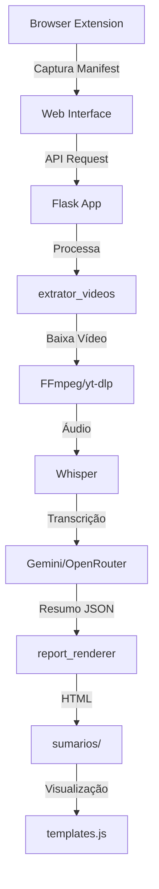

# 📁 Estrutura do Projeto - ExtratorVideosCurso

## Documentação Completa v1.0

> **Última Atualização:** 21/12/2025

Este documento descreve todas as pastas e arquivos do projeto **Video Processor Pro**, um sistema completo para transcrição e resumo de vídeos de cursos online usando IA.

---

## 📋 Índice

1. [Visão Geral](#visão-geral)
2. [Estrutura de Diretórios](#estrutura-de-diretórios)
3. [Arquivos Raiz](#arquivos-raiz)
4. [Browser Extension](#browser-extension)
5. [Core Python (extrator_videos)](#core-python-extrator_videos)
6. [Web Interface](#web-interface)
7. [Design System](#design-system)
8. [Modelos de Prompts](#modelos-de-prompts)
9. [Documentação](#documentação)
10. [Diretórios de Cache e Dados](#diretórios-de-cache-e-dados)

---

## Visão Geral

```
ExtratorVideosCurso/
├── 📁 browser_extension/    # Extensão Chrome para captura de vídeos
├── 📁 extrator_videos/      # Core Python (transcrição, IA, processamento)
├── 📁 web_interface/        # Interface web Flask (Solar Pop Edition)
├── 📁 design-system/        # Documentação de design system
├── 📁 modelos_prompts/      # Templates de prompts para IA
├── 📁 doc/                  # Documentação técnica
├── 📁 sumarios/             # Relatórios gerados (output)
├── 📁 sumarios_cache/       # Cache de transcrições
├── 📁 resolve_cache/        # Cache de resoluções de URL
├── 📁 logs/                 # Logs de processamento
└── 📁 arquivos_obsoletos/   # Arquivos deprecados
```

---

## Estrutura de Diretórios

### Diretórios Principais

| Diretório | Descrição | Tipo |
|-----------|-----------|------|
| `browser_extension/` | Extensão Chrome para capturar manifests de vídeo | Frontend |
| `extrator_videos/` | Módulo Python principal com toda a lógica de processamento | Backend |
| `web_interface/` | Servidor Flask + interface web Solar Pop | Full-Stack |
| `design-system/` | Documentação visual do design system | Docs |
| `modelos_prompts/` | Templates de prompt em Markdown | Config |
| `doc/` | Documentação técnica do projeto | Docs |

### Diretórios de Dados

| Diretório | Descrição | Gerado |
|-----------|-----------|--------|
| `sumarios/` | Relatórios HTML/JSON gerados por domínio/videoId | Sim |
| `sumarios_cache/` | Cache de transcrições para evitar reprocessamento | Sim |
| `resolve_cache/` | Cache de resoluções de URL | Sim |
| `logs/` | Logs de processamento em JSON | Sim |

---

## Arquivos Raiz

### Configuração

| Arquivo | Descrição |
|---------|-----------|
| `.env` | Variáveis de ambiente (API keys, configurações) |
| `.env.example2` | Exemplo de configuração do `.env` |
| `accounts.json` | Credenciais de acesso a plataformas de cursos |
| `accounts.json.example` | Exemplo de estrutura de credenciais |
| `credentials.json` | Credenciais por domínio (alternativo) |
| `captured_manifests.json` | Cache de manifests capturados pela extensão |
| `targets.txt` | Lista de URLs para processamento em batch |

### Build e Dependências

| Arquivo | Descrição |
|---------|-----------|
| `requirements.txt` | Dependências Python de produção |
| `requirements-dev.txt` | Dependências Python de desenvolvimento |
| `pyproject.toml` | Configuração do projeto Python (PEP 518) |
| `setup.py` | Script de instalação do pacote |
| `pytest.ini` | Configuração do pytest |
| `.flake8` | Configuração do linter Flake8 |

### Documentação e Versionamento

| Arquivo | Descrição |
|---------|-----------|
| `README.md` | Documentação principal do projeto |
| `.gitignore` | Arquivos ignorados pelo Git |
| `processing.log` | Log global de processamento |

---

## Browser Extension

📁 `browser_extension/`

Extensão Chrome para captura automática de manifests de vídeo em plataformas de cursos.

### Arquivos Principais

| Arquivo | Descrição |
|---------|-----------|
| `manifest.json` | Configuração da extensão Chrome (v3) |
| `background.js` | Service Worker - captura de requests de rede, detecção de manifests |
| `popup.html` | Interface do popup da extensão (4 abas) |
| `popup.js` | Lógica principal do popup |
| `content.js` | Script injetado nas páginas - extração de metadados |
| `inject.js` | Script de injeção auxiliar |
| `overlay.js` | Overlay flutuante para páginas de vídeo |
| `processing_ui.js` | UI de processamento com timer e progress |
| `library.js` | Gestão da aba Biblioteca na extensão |

### Ícones

| Arquivo | Descrição |
|---------|-----------|
| `icon16.png` | Ícone 16x16 (toolbar) |
| `icon48.png` | Ícone 48x48 (extensões) |
| `icon128.png` | Ícone 128x128 (store) |
| `icone128.svg` | Ícone vetorial |
| `Gemini_Generated_Image_*.png` | Imagens geradas para branding |

### Documentação da Extensão

| Arquivo | Descrição |
|---------|-----------|
| `README.md` | Documentação da extensão |
| `COMO_TESTAR.md` | Guia de testes da extensão |

---

## Core Python (extrator_videos)

📁 `extrator_videos/`

Módulo Python com toda a lógica de processamento de vídeos.

### CLI e Entrada

| Arquivo | Descrição |
|---------|-----------|
| `__init__.py` | Inicialização do módulo |
| `cli.py` | Interface de linha de comando simples |
| `batch_cli.py` | CLI para processamento em batch (múltiplos vídeos) |
| `transcribe_cli.py` | CLI específico para transcrição |

### Navegação e Extração

| Arquivo | Descrição |
|---------|-----------|
| `browser.py` | Controle do Playwright para navegação |
| `extractor.py` | Extração de URLs de vídeo das páginas |
| `resolver.py` | Resolução de URLs de manifest |
| `metadata.py` | Extração de metadados de vídeos |
| `network_capture.py` | Captura de requests de rede |

### Download e Processamento de Vídeo

| Arquivo | Descrição |
|---------|-----------|
| `downloader.py` | Download genérico de vídeos |
| `hls_downloader.py` | Download específico de streams HLS |
| `hls.py` | Utilitários para streams HLS |
| `youtube_downloader.py` | Download via yt-dlp (YouTube e outras plataformas) |
| `drm.py` | Detecção de proteção DRM |
| `postprocess.py` | Pós-processamento de arquivos de mídia |

### Transcrição

| Arquivo | Descrição |
|---------|-----------|
| `transcription.py` | Interface principal de transcrição |
| `whisper_engine.py` | Engine Whisper para transcrição de áudio |
| `transcription_cache.py` | Cache de transcrições |

### IA e Resumo

| Arquivo | Descrição |
|---------|-----------|
| `gemini_client.py` | Cliente da API Google Gemini |
| `openrouter_client.py` | Cliente da API OpenRouter (fallback) |
| `prompt_loader.py` | Carregador de templates de prompt |
| `prompt_manager.py` | Gerenciador de prompts |
| `prompt_validator.py` | Validador de estrutura de prompts |
| `prompt_optimizer.py` | Otimizador de prompts |

### Output e Relatórios

| Arquivo | Descrição |
|---------|-----------|
| `report_renderer.py` | Renderizador de relatórios HTML |
| `schema.py` | Schema de dados do relatório |

### Autenticação e Segurança

| Arquivo | Descrição |
|---------|-----------|
| `auth.py` | Autenticação em plataformas de cursos |
| `credential_manager.py` | Gerenciador de credenciais |
| `antibot.py` | Bypass de proteções anti-bot |
| `security.py` | Utilitários de segurança |

### Utilitários

| Arquivo | Descrição |
|---------|-----------|
| `logger_json.py` | Logger estruturado em JSON |
| `instrumentation.py` | Instrumentação e métricas |
| `verifications.py` | Verificações de integridade |
| `resolve_cache.py` | Cache de resoluções de URL |
| `dash.py` | Utilitários para streams DASH |

---

## Web Interface

📁 `web_interface/`

Servidor Flask e interface web Solar Pop Edition.

### Arquivos Principais

| Arquivo | Descrição |
|---------|-----------|
| `app.py` | Servidor Flask principal (97KB - endpoints, WebSocket, processamento) |
| `requirements.txt` | Dependências específicas da web interface |
| `start.bat` | Script de inicialização Windows |
| `start.sh` | Script de inicialização Linux/Mac |

### Templates HTML

📁 `web_interface/templates/`

| Arquivo | Descrição |
|---------|-----------|
| `index_v2.html` | Interface principal Solar Pop (50KB) |
| `report_standalone.html` | Template de relatório standalone |
| `settings.html` | Modal de configurações (legado) |

### JavaScript

📁 `web_interface/static/js/`

| Arquivo | Descrição |
|---------|-----------|
| `main_v2.js` | Lógica principal da interface (91KB) |
| `templates.js` | Templates de renderização de relatórios (43KB) |
| `extension_manifests.js` | Gestão de manifests da extensão (30KB) |
| `templates.js.backup` | Backup do templates.js |

### Documentação Interna

| Arquivo | Descrição |
|---------|-----------|
| `README.md` | Documentação da web interface |
| `APLICAR_MELHORIAS.md` | Lista de melhorias a aplicar |
| `MELHORIAS_UX_UI.md` | Melhorias de UX/UI planejadas |
| `RESUMO_MELHORIAS_IMPLEMENTADAS.md` | Histórico de melhorias |
| `VERIFICAR_PROCESSAMENTO.md` | Checklist de verificação |

---

## Design System

📁 `design-system/`

Documentação completa do design system Solar Pop Edition.

### Interface Web

| Arquivo | Descrição |
|---------|-----------|
| `design-system-interface-web-video-processor-solar-pop-edition.md` | Design system principal |
| `design-system-edito-de-prompts.md` | Design system do Editor de Prompts |
| `design-system-configuracoes.md` | Design system do Modal de Configurações |
| `design-system-relatorio.md` | Design system do Relatório de Vídeo |

### Extensão

| Arquivo | Descrição |
|---------|-----------|
| `design-system-extensao-aba-captura.md` | Design system da Aba Captura |
| `design-system-extensao-aba-manifests.md` | Design system da Aba Manifests |
| `design-system-extensao-aba-biblioteca.md` | Design system da Aba Biblioteca |
| `design-system-extensao-aba-config.md` | Design system da Aba Config |

---

## Modelos de Prompts

📁 `modelos_prompts/`

Templates de prompt para geração de resumos por IA.

| Arquivo | Descrição |
|---------|-----------|
| `README.md` | Documentação dos modelos de prompt |
| `template.md` | Template base com todas as variáveis |
| `modelo2.md` | Modelo padrão (notas de estudo) |
| `modelo3.md` | Modelo alternativo |
| `modelo4.md` | **P.R.O.M.P.T.** - Modelo premium com 14 seções |
| `modelo5.md` | Modelo experimental |
| `modelo6.md` | Modelo em desenvolvimento |

---

## Documentação

📁 `doc/`

Documentação técnica do projeto.

| Arquivo | Descrição |
|---------|-----------|
| `QUICK_START.md` | Guia de início rápido |
| `MODOS_DE_USO.md` | Modos de uso do sistema |
| `BATCH_PROCESSING.md` | Processamento em batch |
| `FALLBACK_SYSTEM.md` | Sistema de fallback Gemini/OpenRouter |
| `OPENROUTER_GUIDE.md` | Guia de uso do OpenRouter |
| `OPENROUTER_FREE_MODELS.md` | Modelos gratuitos do OpenRouter |
| `MODELS_ANALYSIS.md` | Análise comparativa de modelos de IA |
| `GITHUB_SETUP.md` | Configuração do repositório GitHub |

---

## Diretórios de Cache e Dados

### sumarios/

📁 `sumarios/{domain}/{videoId}/`

Estrutura de armazenamento de relatórios gerados:

```
sumarios/
├── www.youtube.com/
│   └── jl6jXE1KQMY/
│       ├── resumo_jl6jXE1KQMY.html    # Relatório HTML
│       └── resumo_jl6jXE1KQMY.json    # Dados JSON
├── members.kiwify.com/
│   └── abc123/
│       ├── resumo_abc123.html
│       └── resumo_abc123.json
└── ...
```

### sumarios_cache/

Cache de transcrições para evitar reprocessamento:

```
sumarios_cache/
├── {hash}_transcription.json    # Transcrição cacheada
└── ...
```

### resolve_cache/

Cache de resoluções de URL:

```
resolve_cache/
└── {hash}.json    # Resultado de resolução
```

### logs/

Logs estruturados em JSON:

```
logs/
├── processing_YYYYMMDD.log
└── ...
```

---

## Fluxo de Dados



---

## Tecnologias Utilizadas

### Backend
- **Python 3.11+**
- **Flask** - Servidor web
- **Playwright** - Automação de browser
- **Whisper** - Transcrição de áudio (OpenAI)
- **FFmpeg** - Processamento de mídia
- **yt-dlp** - Download de vídeos

### Frontend
- **HTML5/CSS3/JavaScript**
- **Tailwind CSS** - Framework de estilos
- **Socket.IO** - Comunicação em tempo real
- **Google Fonts** - Tipografia (Inter, Space Grotesk)

### APIs
- **Google Gemini** - Geração de resumos (primário)
- **OpenRouter** - Geração de resumos (fallback)

### Extensão
- **Chrome Extension (Manifest v3)**
- **Service Workers**
- **Content Scripts**

---

## Changelog

| Versão | Data | Alterações |
|--------|------|------------|
| v1.0 | 21/12/2025 | Criação inicial do documento |

---

**FIM DO DOCUMENTO**
